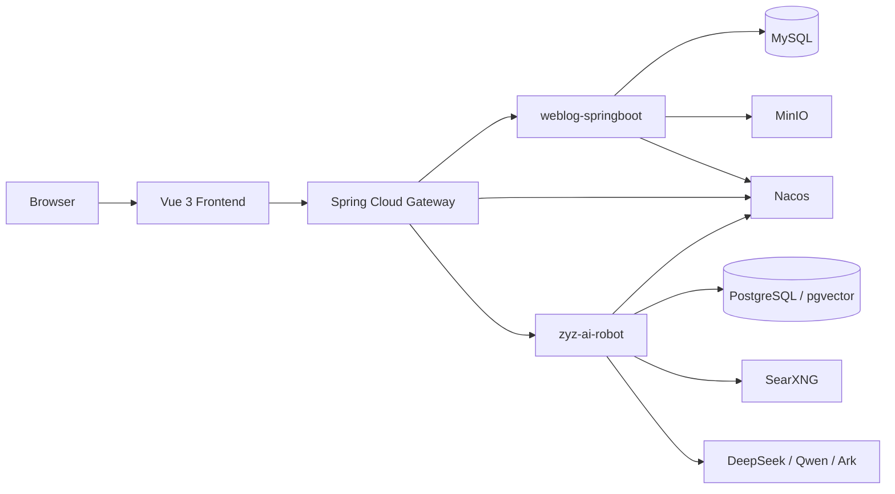

# AI Weblog Continued Project

<p align="center">
  
</p>

> 一个把博客系统、后台管理、Spring Cloud Gateway、AI 对话和知识库能力整合到一起的全栈项目，适合学习 `Java 后端 + AI 应用 + 前后端协同`，也适合作为可继续迭代的个人开源作品。

仓库中的真实密码、API Key、服务器地址、Nacos 私有配置和部署信息已经移除或脱敏。当前公开版本默认保留：

- 博客主链路
- 网关转发
- AI 对话 / 知识库模块
- Docker Compose 基础设施模板
- Nacos 脱敏配置模板

## Features

- 博客前台：文章列表、文章详情、归档、分类、标签页
- 后台管理：文章发布、文章编辑、分类管理、标签管理、博客设置、文件上传
- 网关层：统一入口、服务发现、JWT 校验、路由转发
- AI 能力：多模型聊天、文章 AI 润色、知识库 Markdown 上传、知识库问答
- 基础设施：Nacos、MySQL、PostgreSQL + pgvector、MinIO、SearXNG、Docker Compose

## Tech Stack

| Layer | Stack |
| --- | --- |
| Frontend | Vue 3, Vite, Vue Router, Pinia, Element Plus, Tailwind CSS |
| Gateway | Spring Boot 3.2, Spring Cloud Gateway, Nacos Discovery, JWT |
| Blog Service | Spring Boot 3.2, MyBatis-Plus, MySQL, MinIO, Knife4j |
| AI Service | Spring Boot 3.2, Spring AI, PostgreSQL, pgvector, SearXNG |
| Config / Infra | Nacos, Docker Compose, GitHub Actions, Docker Hub |

## Architecture



### Service Responsibilities

| Service | Responsibility | Default Runtime Port |
| --- | --- | --- |
| `weblog-frontend` | Public UI and admin UI | `80` |
| `weblog-gateway` | Unified ingress, route forwarding, JWT validation | `8081` |
| `weblog-springboot` | Blog business logic and admin APIs | `8082` |
| `zyz-ai-robot` | AI chat, knowledge base, model orchestration | `8080` |

## Repository Layout

```text
.
+-- backend/
|   +-- weblog-springboot/         # Blog service (multi-module Maven project)
|   +-- weblog-gateway/            # API gateway
|   `-- zyz-ai-robot-springboot/   # AI service
+-- front/
|   `-- weblog-vue3/               # Vue 3 frontend
+-- docs/
|   +-- examples/nacos/prod/       # Sanitized Nacos production templates
|   +-- examples/schema/           # Schema examples inferred from entity classes
|   `-- screenshots/               # Screenshot placeholder notes
+-- nacos-configs/                 # Local private Nacos configs, ignored by Git
+-- docker-compose.yml             # Local infrastructure
`-- .env.example                   # Local environment variable template
```

## Quick Start

### Prerequisites

- JDK 21
- Maven 3.9+
- Node.js 18+
- Docker / Docker Compose
- A working Nacos instance

### 1. Prepare Local Infrastructure Variables

Copy `.env.example` to `.env`:

```powershell
Copy-Item .env.example .env
```

At minimum, confirm these values for your local environment:

| Variable | Purpose |
| --- | --- |
| `MYSQL_ROOT_PASSWORD` | MySQL root password |
| `MYSQL_DATABASE` | Blog database name |
| `POSTGRES_PASSWORD` | AI module database password |
| `POSTGRES_DB` | AI module database name |
| `MINIO_ROOT_USER` | MinIO username |
| `MINIO_ROOT_PASSWORD` | MinIO password |
| `SEARXNG_SECRET` | SearXNG instance secret |

Start infrastructure:

```powershell
docker compose up -d
```

Notes:

- 当前仓库未附带数据库初始化 SQL
- `docker compose` 负责启动基础设施容器，不负责自动建表
- MySQL / PostgreSQL schema 需要你自己准备

### 2. Prepare Nacos Configs

后端服务默认依赖 Nacos 配置。  
你本地真实配置通常会放在私有的 `nacos-configs/prod/` 或 `nacos-configs/dev/`，公开仓库里只保留了脱敏模板：

- [docs/examples/nacos/prod/weblog-springboot.example.yml](docs/examples/nacos/prod/weblog-springboot.example.yml)
- [docs/examples/nacos/prod/weblog-gateway.example.yml](docs/examples/nacos/prod/weblog-gateway.example.yml)
- [docs/examples/nacos/prod/zyz-ai-robot.example.yml](docs/examples/nacos/prod/zyz-ai-robot.example.yml)

本地文件名和 Nacos Data ID 需要分开理解：

| Local File | Namespace | Nacos Data ID |
| --- | --- | --- |
| `weblog-springboot-prod.yml` | `prod` | `weblog-springboot.yml` |
| `weblog-gateway-prod.yml` | `prod` | `weblog-gateway.yml` |
| `zyz-ai-robot-prod.yml` | `prod` | `zyz-ai-robot.yml` |

也就是说：

- 本地磁盘里的文件名可以带 `-prod`
- 上传到 Nacos 后，Data ID 仍然建议使用服务名对应的 `.yml`
- `dev` 和 `prod` 的主要区别通常是 namespace 和具体参数值，不一定是 Data ID 不同

本地开发建议：

1. 在 Nacos 中创建 `dev` namespace
2. 复制这些脱敏模板
3. 将数据库地址、MinIO 地址、模型 Key、JWT 等替换成你自己的本地值
4. 使用 `weblog-springboot.yml`、`weblog-gateway.yml`、`zyz-ai-robot.yml` 作为 `dev` namespace 下的 Data ID

### 2.1 Database Schema

我已经根据实体类和 Mapper 查询方式整理了一份最小可参考 schema：

- [docs/examples/schema/blog-mysql.example.sql](docs/examples/schema/blog-mysql.example.sql)
- [docs/examples/schema/ai-robot-postgres.example.sql](docs/examples/schema/ai-robot-postgres.example.sql)

说明：

- 这两份 SQL 是根据当前实体类、表名和常用查询推断出的公开版示例
- 足够帮助你理解核心表结构、主键关系和索引方向
- 如果你的部署依赖迁移工具、自动建表或额外框架表，请按实际版本自行调整

### 3. Start Backend Services

推荐直接通过 IDE 运行以下启动类：

| Module | Main Class |
| --- | --- |
| `weblog-springboot` | `com.zhouyuanzhi.weblog.web.WeblogWebApplication` |
| `weblog-gateway` | `com.zyz.weblog.gateway.WeblogGatewayApplication` |
| `zyz-ai-robot` | `com.zhouyuanzhi.ai.robot.ZhouyuanzhiAiRobotSpringbootApplication` |

Command line examples:

```powershell
cd backend/weblog-springboot
mvn -pl weblog-web spring-boot:run
```

```powershell
cd backend/weblog-gateway
mvn spring-boot:run
```

```powershell
cd backend/zyz-ai-robot-springboot
mvn spring-boot:run
```

说明：

- `weblog-springboot` 和 `weblog-gateway` 是博客主链路必需
- `zyz-ai-robot` 是可选模块，但如果你要体验 AI 对话、知识库和文章润色，则需要启动

### 4. Start Frontend

```powershell
cd front/weblog-vue3
npm install
npm run dev
```

## Local Runtime Parameters

以下参数已经在仓库中保留为环境变量占位：

| Variable | Used By | Purpose |
| --- | --- | --- |
| `NACOS_SERVER_ADDR` | All backend services | Nacos 地址，默认占位 `127.0.0.1:8848` |
| `NACOS_NAMESPACE` | All backend services | Nacos namespace，默认占位 `dev` / `prod` |
| `WEBLOG_DB_URL` | `weblog-springboot` | Blog MySQL connection URL |
| `WEBLOG_DB_USERNAME` | `weblog-springboot` | Blog MySQL username |
| `WEBLOG_DB_PASSWORD` | `weblog-springboot` | Blog MySQL password |
| `MINIO_ENDPOINT` | `weblog-springboot` | MinIO endpoint |
| `MINIO_ACCESS_KEY` | `weblog-springboot` | MinIO access key |
| `MINIO_SECRET_KEY` | `weblog-springboot` | MinIO secret key |
| `MINIO_BUCKET_NAME` | `weblog-springboot` | MinIO bucket name |

## Production Deployment Parameters

当前 GitHub Actions 默认部署以下镜像：

- `weblog-springboot`
- `weblog-gateway`
- `zyz-ai-robot`
- `weblog-frontend`

在 GitHub 仓库中打开 `Settings -> Secrets and variables -> Actions`，至少准备：

### Required Secrets

| Secret | Purpose |
| --- | --- |
| `DOCKER_USERNAME` | Docker Hub 用户名或组织名 |
| `DOCKER_PASSWORD` | Docker Hub 密码或 Access Token |
| `SERVER_HOST` | 部署服务器公网地址 |
| `SERVER_USER` | SSH 登录用户 |
| `SERVER_PASSWORD` | SSH 登录密码 |
| `JWT_SECRET` | 线上 JWT 密钥 |
| `NACOS_SERVER_ADDR` | 线上 Nacos 地址，例如 `host:8848` |

### Optional Variables

| Variable | Default | Purpose |
| --- | --- | --- |
| `NACOS_NAMESPACE` | `prod` | GitHub Actions 部署时使用的 Nacos namespace |

## Sanitized Nacos Config Notes

`docs/examples/nacos/prod/` 下的模板，是按你本地私有 Nacos 配置结构脱敏后的公开版。

主要被脱敏的参数类型包括：

- 数据库地址、用户名、密码
- MinIO 地址、Access Key、Secret Key
- JWT Secret
- DeepSeek / Qwen / Ark 等模型 API Key
- SearXNG 私有服务地址
- 私有存储路径与服务器公网地址

保留下来的内容主要是结构信息：

- 服务端口
- 路由规则
- 鉴权白名单与受保护路径
- 各模块所需的配置项名称
- 向量库、搜索、模型接入的大体配置形态

## Database Notes

当前公开仓库的数据库说明分成两类：

- 博客主链路表：由 `weblog-module-common` 下的 DO 类可以直接推断
- AI 业务表：由 `zyz-ai-robot` 下的 DO 类可以直接推断

额外要注意一张非 DO 直出的表：

- `t_vector_store`

原因是 AI 模块使用了 `Spring AI + pgvector`，并且在代码里直接对 `t_vector_store` 做删除操作。  
这张表更接近“向量存储框架表”，不是普通业务实体表，因此我没有在 README 里强行写死它的完整 DDL。更稳妥的做法是：

1. 先看你当前使用的 Spring AI / pgvector 版本
2. 再决定是让框架自动初始化，还是手工建表
3. 如果手工建表，确保至少包含向量字段和 `metadata` JSONB 字段，并与配置中的 `table-name: t_vector_store` 保持一致

## Suggested Open-Source Checklist

- 删除或忽略所有真实 `.env`、私有脚本和本地 Nacos 配置
- 确保 README 中只出现示例值和占位符
- 确保 GitHub Actions Secrets 已补齐
- 确保历史提交里没有遗留真实密码、Key 和服务器地址
- 如敏感值曾经提交过，务必轮换对应密码和密钥

## Screenshots

公开仓库当前没有提交真实运行截图。  
如果后续你要补图，建议至少准备：

- 前台首页
- 后台文章管理页
- AI 对话页
- 知识库管理页

截图命名建议见 [docs/screenshots/README.md](docs/screenshots/README.md)。

## Notes

- `SERVER_HOST` 不等于 `NACOS_SERVER_ADDR`
- 根目录 `.env` 主要给 `docker compose` 用，不代表所有 Spring Boot 服务都会自动读取
- 如果你使用旧 Docker volume，修改密码后要同步更新本地配置，否则会因密码不匹配导致启动失败
- 如果只想先跑博客主链路，可以先不启动 `zyz-ai-robot`
