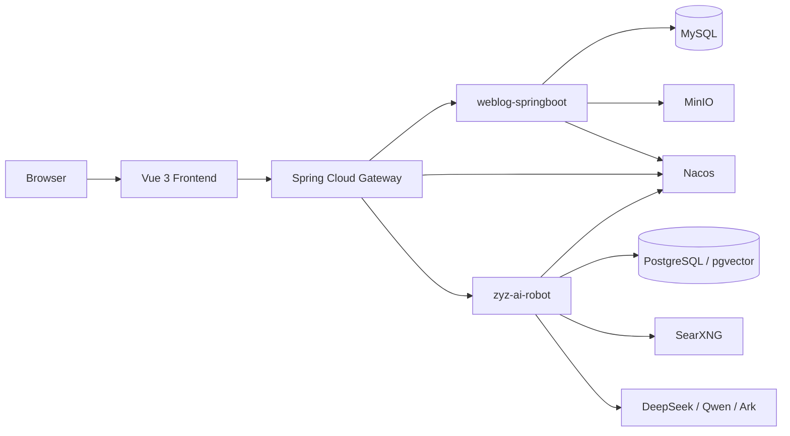

# AI Weblog Continued Project

<p align="center">
  
</p>

一个面向开源协作整理过的个人全栈项目，包含博客前台、后台管理、网关转发，以及可选的 AI 对话与知识库模块。

为了方便公开仓库协作，代码仓库中的真实密码、API Key、服务器地址、Nacos 私有配置和部署信息已经移除或脱敏。你现在看到的是一个可公开分享的版本：

- 本地基础设施通过 `.env` 和 `docker-compose.yml` 启动
- 后端服务通过环境变量和 Nacos 获取配置
- 线上部署通过 GitHub Actions Secrets / Variables 注入敏感参数
- 当前公开版本默认只保留博客主链路与 AI 模块

## What This Project Includes

- 博客前台：文章列表、文章详情、归档、分类、标签页
- 后台管理：文章发布、文章编辑、分类管理、标签管理、博客设置、文件上传
- 网关层：统一入口、服务发现、鉴权拦截、路由转发
- AI 能力：多模型聊天、文章 AI 润色、知识库 Markdown 上传、知识库问答
- 基础设施：Nacos、MySQL、PostgreSQL + pgvector、MinIO、SearXNG、Docker Compose

## Tech Stack

| Layer | Stack |
| --- | --- |
| Frontend | Vue 3, Vite, Vue Router, Pinia, Element Plus, Tailwind CSS |
| Gateway | Spring Boot 3.2, Spring Cloud Gateway, Nacos Discovery, JWT |
| Blog Service | Spring Boot 3.2, MyBatis-Plus, MySQL, MinIO, Knife4j |
| AI Service | Spring Boot 3.2, Spring AI, PostgreSQL, pgvector, SearXNG |
| Config / Infra | Nacos, Docker Compose, GitHub Actions, Docker Hub |

## Architecture



### Service Responsibilities

| Service | Responsibility | Default Runtime Port |
| --- | --- | --- |
| `weblog-frontend` | Public UI and admin UI | `80` |
| `weblog-gateway` | Unified ingress, route forwarding, JWT validation | `8081` |
| `weblog-springboot` | Blog business logic and admin APIs | `8082` |
| `zyz-ai-robot` | AI chat, knowledge base, model orchestration | `8080` |

## Repository Layout

```text
.
+-- backend/
|   +-- weblog-springboot/         # Blog service (multi-module Maven project)
|   +-- weblog-gateway/            # API gateway
|   `-- zyz-ai-robot-springboot/   # AI service
+-- front/
|   `-- weblog-vue3/               # Vue 3 frontend
+-- docs/
|   +-- examples/nacos/prod/       # Sanitized Nacos production templates
|   `-- screenshots/               # Screenshot placeholder notes
+-- nacos-configs/                 # Local private Nacos configs, ignored by Git
+-- docker-compose.yml             # Local infrastructure
`-- .env.example                   # Local environment variable template
```

## Screenshots

公开仓库当前没有提交真实运行截图，但建议至少准备以下 3 张截图后再完善 README：

- 前台首页：文章卡片、分页、分类/标签侧栏
- 后台文章管理：文章列表、Markdown 编辑器、AI 润色入口
- AI 对话页：多模型切换、会话列表、知识库问答

截图占位和命名建议见 [docs/screenshots/README.md](docs/screenshots/README.md)。

## Quick Start

### Prerequisites

- JDK 21
- Maven 3.9+
- Node.js 18+
- Docker / Docker Compose
- 一个可用的 Nacos 实例

### 1. Prepare Local Infrastructure Variables

复制 `.env.example` 为 `.env`：

```powershell
Copy-Item .env.example .env
```

最少需要根据你的本地环境确认这些变量：

| Variable | Purpose |
| --- | --- |
| `MYSQL_ROOT_PASSWORD` | MySQL root 密码 |
| `MYSQL_DATABASE` | 博客数据库名 |
| `POSTGRES_PASSWORD` | AI 机器人数据库密码 |
| `POSTGRES_DB` | AI 机器人数据库名 |
| `MINIO_ROOT_USER` | MinIO 用户名 |
| `MINIO_ROOT_PASSWORD` | MinIO 密码 |
| `SEARXNG_SECRET` | SearXNG 实例密钥 |

启动基础设施：

```powershell
docker compose up -d
```

说明：

- 当前仓库未附带数据库初始化 SQL，因此 `docker compose` 负责启动基础设施容器，不负责自动建表
- 你需要自行准备 MySQL / PostgreSQL 的表结构和初始化数据

### 2. Prepare Nacos Configs

后端服务默认依赖 Nacos 配置。  
你本地的真实配置文件在 `nacos-configs/prod/`，但这个目录被 Git 忽略，不会进入开源仓库。

我已经根据你本地 `nacos-configs/prod/` 的结构，整理了一份脱敏公开版模板：

- [docs/examples/nacos/prod/weblog-springboot.example.yml](docs/examples/nacos/prod/weblog-springboot.example.yml)
- [docs/examples/nacos/prod/weblog-gateway.example.yml](docs/examples/nacos/prod/weblog-gateway.example.yml)
- [docs/examples/nacos/prod/zyz-ai-robot.example.yml](docs/examples/nacos/prod/zyz-ai-robot.example.yml)

对应关系要注意两层：

| Local File | Namespace | Nacos Data ID |
| --- | --- | --- |
| `weblog-springboot-prod.yml` | `prod` | `weblog-springboot.yml` |
| `weblog-gateway-prod.yml` | `prod` | `weblog-gateway.yml` |
| `zyz-ai-robot-prod.yml` | `prod` | `zyz-ai-robot.yml` |

也就是说：

- 你本地磁盘里的文件名可以带 `-prod`
- 上传到 Nacos 后，Data ID 仍然是服务名对应的 `.yml`
- `dev` 和 `prod` 的主要区别通常是 `namespace` 和具体参数值，不一定是 Data ID 命名不同

如果你要跑本地开发环境，推荐做法是：

1. 在 Nacos 中创建 `dev` namespace
2. 复制这些脱敏模板
3. 将数据库地址、MinIO 地址、模型 Key、JWT 等替换成你自己的本地值
4. 用 `weblog-springboot.yml`、`weblog-gateway.yml`、`zyz-ai-robot.yml` 作为 `dev` namespace 下的 Data ID

### 3. Start Backend Services

推荐直接通过 IDE 运行以下启动类：

| Module | Main Class |
| --- | --- |
| `weblog-springboot` | `com.zhouyuanzhi.weblog.web.WeblogWebApplication` |
| `weblog-gateway` | `com.zyz.weblog.gateway.WeblogGatewayApplication` |
| `zyz-ai-robot` | `com.zhouyuanzhi.ai.robot.ZhouyuanzhiAiRobotSpringbootApplication` |

如果你更习惯命令行，可以参考：

```powershell
cd backend/weblog-springboot
mvn -pl weblog-web spring-boot:run
```

```powershell
cd backend/weblog-gateway
mvn spring-boot:run
```

```powershell
cd backend/zyz-ai-robot-springboot
mvn spring-boot:run
```

说明：

- `weblog-springboot` 和 `weblog-gateway` 是博客主链路必需
- `zyz-ai-robot` 是可选模块，但如果你要体验 AI 对话、知识库和文章润色，则需要启动

### 4. Start Frontend

```powershell
cd front/weblog-vue3
npm install
npm run dev
```

## Local Runtime Parameters

以下参数已在仓库中保留为环境变量占位：

| Variable | Used By | Purpose |
| --- | --- | --- |
| `NACOS_SERVER_ADDR` | All backend services | Nacos 地址，默认占位 `127.0.0.1:8848` |
| `NACOS_NAMESPACE` | All backend services | Nacos namespace，默认占位 `dev` / `prod` |
| `WEBLOG_DB_URL` | `weblog-springboot` | 博客 MySQL 连接串 |
| `WEBLOG_DB_USERNAME` | `weblog-springboot` | 博客 MySQL 用户名 |
| `WEBLOG_DB_PASSWORD` | `weblog-springboot` | 博客 MySQL 密码 |
| `MINIO_ENDPOINT` | `weblog-springboot` | MinIO 地址 |
| `MINIO_ACCESS_KEY` | `weblog-springboot` | MinIO Access Key |
| `MINIO_SECRET_KEY` | `weblog-springboot` | MinIO Secret Key |
| `MINIO_BUCKET_NAME` | `weblog-springboot` | MinIO Bucket 名称 |
## Production Deployment Parameters

当前 GitHub Actions 默认部署以下镜像：

- `weblog-springboot`
- `weblog-gateway`
- `zyz-ai-robot`
- `weblog-frontend`

在 GitHub 仓库中打开 `Settings -> Secrets and variables -> Actions`，至少准备：

### Required Secrets

| Secret | Purpose |
| --- | --- |
| `DOCKER_USERNAME` | Docker Hub 用户名或组织名 |
| `DOCKER_PASSWORD` | Docker Hub 密码或 Access Token |
| `SERVER_HOST` | 部署服务器公网地址 |
| `SERVER_USER` | SSH 登录用户 |
| `SERVER_PASSWORD` | SSH 登录密码 |
| `JWT_SECRET` | 线上 JWT 密钥 |
| `NACOS_SERVER_ADDR` | 线上 Nacos 地址，例如 `host:8848` |

### Optional Variables

| Variable | Default | Purpose |
| --- | --- | --- |
| `NACOS_NAMESPACE` | `prod` | GitHub Actions 部署时使用的 Nacos namespace |

## Sanitized Nacos Config Notes

`docs/examples/nacos/prod/` 下的模板，是按你本地 `nacos-configs/prod/` 真实结构脱敏后的公开版。

主要被脱敏的参数类型包括：

- 数据库地址、用户名、密码
- MinIO 地址、Access Key、Secret Key
- JWT Secret
- DeepSeek / Qwen / Ark 等模型 API Key
- SearXNG 私有服务地址
- 私有存储路径与服务器公网地址

保留下来的内容主要是结构信息：

- 服务端口
- 路由规则
- 鉴权白名单与受保护路径
- 各模块所需的配置项名称
- 向量库、搜索、模型接入的大体配置形态

这意味着别人克隆仓库后，可以直接知道：

- 每个服务需要哪些配置块
- 每个配置块的字段名是什么
- 应该往哪个 namespace / dataId 上传
- 哪些值必须替换成自己的私有参数

## Suggested Open-Source Checklist

- 删除或忽略所有真实 `.env`、私有脚本和本地 Nacos 配置
- 确保 README 中只出现示例值和占位符
- 确保 GitHub Actions Secrets 已补齐
- 确保历史提交里没有遗留真实密码、Key 和服务器地址
- 如敏感值曾经提交过，务必轮换对应密码和密钥

## Notes

- `SERVER_HOST` 不等于 `NACOS_SERVER_ADDR`
- 根目录 `.env` 主要给 `docker compose` 用，不代表所有 Spring Boot 服务都会自动读取
- 如果你使用旧 Docker volume，修改密码后要同步更新本地配置，否则会因密码不匹配导致启动失败
- 如果只想先跑博客主链路，可以先不启动 `zyz-ai-robot`
